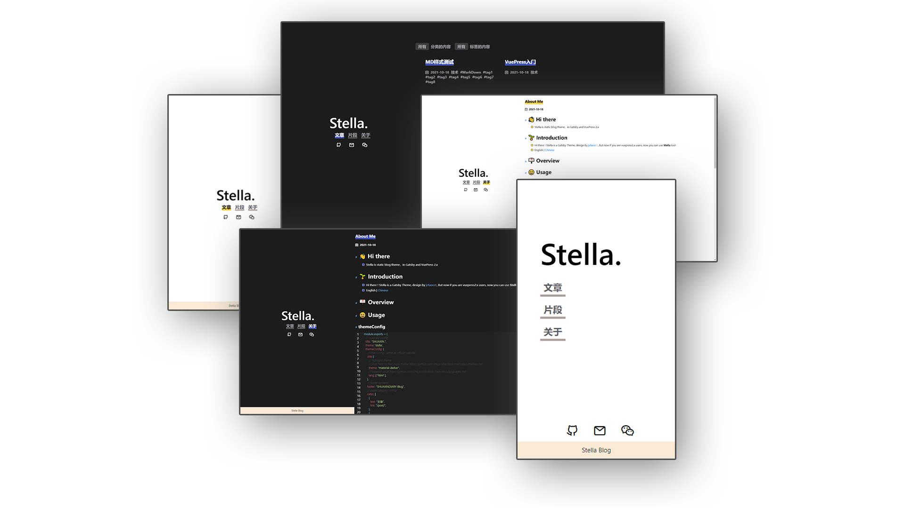

# 简介
- Stella 是一个Gatsby的主题, 由[jctaoo](https://github.com/jctaoo)设计, 如果你是vuepress2.x的用户，现在也可以做在vuepress中使用这个主题啦
- [英语](./README.md) | 中文
****
# 概览



# 使用
 
## 主题配置

```ts
interface ICommon {
  label: string;
  link: string;
}

type Ifooter = ICommon;
type Icons = ICommon;
type Icates = ICommon;

interface ThemeConfig extends VupressSiteConfig {
  shiki?: HighlighterOptions;
  footer?: string | Ifooter;
  cates?: Icates[];
  icons?: Icons[];
}
```


<!-- # Feature -->

# TODO
- [x] 支持配置外链 
- [x] 支持跟随系统切换模式（深色/浅色） 
- [x] Stella md 文件样式
- [x] 支持分类、tag过滤文章 
- [ ] 默认页支持配置开关 
- [x] 支持评论系统 
- [ ] 支持切换主题色 
- [ ] 支持分页 
- [ ] 支持文档、博客模式 
- [x] 移动端适配 
- [ ] 文章页配置banner图
- [ ] 全文搜索
- [ ] 友链

# License
[](https://opensource.org/licenses/0BSD)


[LICENSE](https://github.com/SHUAXINDIARY/vuepress-theme-stella/blob/main/LICENSE) file
